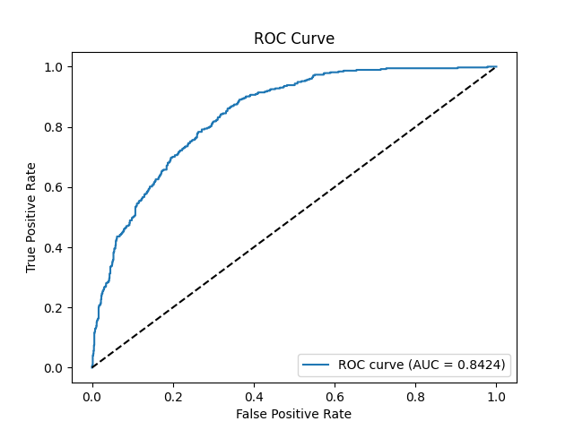
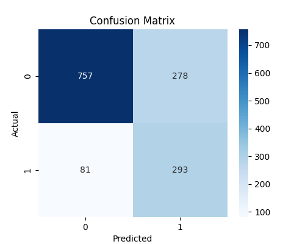
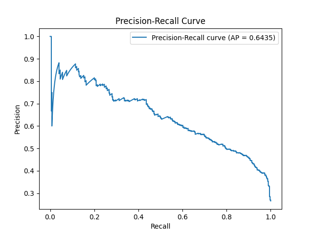

# 📦 MLOps-Telecom-Churn-Detection

**An advanced end-to-end **MLOps pipeline** for Telecom Customer Churn Prediction using **ZenML**, **MLflow**, **Docker**, **GitHub Actions**, and **AWS EC2**. This project automates everything from data ingestion, preprocessing, model training & evaluation, deployment, drift detection, and CI/CD.**

[](https://zenml.io/)
[](https://mlflow.org/)
[](https://www.docker.com/)
[](https://streamlit.io/)
[](https://github.com/features/actions)
[](https://aws.amazon.com/ec2/)
[](https://aws.amazon.com/dynamodb/)
[](https://evidentlyai.com/)
[](https://docs.pytest.org/)
[](https://www.python.org/)

---

## 🧠 Project Overview

**Goal:** Predict whether a telecom customer will churn based on customer and service attributes.

**Key Features:**

* End-to-end modular MLOps architecture
* ZenML pipelines for orchestration
* MLflow tracking
* Dockerized deployment with Streamlit
* Drift detection & auto-retraining via GitHub Actions
* CI/CD: Testing, Docker Build & Deployment via GitHub Actions
* Hosted on AWS EC2
* DynamoDB integration for storing inference data

---

## 📂 Project Structure

```
MLOps-Telecom-Churn-Detection/
├── .github/workflows/              # CI/CD pipeline using GitHub Actions
│   └── cicd.yml                    # Automates tests, Docker build, and deployment to EC2
│   └── drift_detection.yml         # Workflow for scheduled drift detection and retraining
│
├── data/    
│   ├── raw/                        # Original Telco churn CSV file
│   ├── processed/                  # Cleaned and split data: train.csv, val.csv, test.csv
│   └── reference/                  # Stores reference data for drift detection       
│
├── model/                             # Trained and serialized model files
│   ├── best_model.pkl             # Best selected model
│   ├── transformer.pkl            # Preprocessing transformer object
│   └── [other models].pkl         # Additional model candidates (XGBoost, Random Forest, and Logistic Regression.)
│
├── artifacts/                         # Model evaluation results and visuals
│   └── evaluation/                # Includes plots and reports
│       ├── roc_curve_<model>.png
│       ├── precision_recall_curve_<model>.png
│       ├── confusion_matrix_<model>.png
│       ├── classification_report_<model>.txt
│       ├── # Other metrics
│
├── data_analysis/ 
│   ├── eda.ipynb                  # Jupyter Notebook to demonstrate EDA
│   ├── initial_inspection.py
│   ├── univariate_analysis.py
│   ├── bivariate_analysis.py
│   ├── multivariate_analysis.py
│   ├── missing_values_analysis.py
│
├── pipelines/                         # ZenML pipeline definitions
│   └── training_pipeline.py       # Main ZenML training + deployment pipeline
│
├── src/                               # Core pipeline components and logic
│   ├── config.py                  # Global config variables and paths
│   ├── utils.py                  # utils for logging 
│   ├── data_ingestion.py         # Raw dataset reading logic
│   ├── preprocessing.py          # Data cleaning and transformation
│   ├── feature_engineering.py    # Feature creation and encoding
│   ├── splitting.py              # Splits the dataset into train/val/test
│   ├── training.py               # Trains multiple models
│   ├── evaluation.py             # Generates classification metrics and plots
│   ├── deployment.py             # Deploys a Streamlit app to EC2 using Docker
│   ├── drift_detection.py        # Drift detection
│   └── aws_database.py           # AWS database functions
│
├── tests/                             # Unit and integration tests using Pytest
│   ├── test_data_validation.py
│   ├── test_feature_engineering.py
│   ├── test_model_validation.py
│   ├── test_preprocessing.py
│   ├── test_training.py
│   └── test_smoke.py
│
├── last_processed.txt                 # Last drift detection date
├── run_pipeline.py                    # Entry point to trigger the ZenML pipeline
├── Dockerfile                         # Builds the Docker container for app deployment
├── requirements.txt                   # All Python dependencies
├── deploy_requirements.txt            # All Python dependencies required for deployment
├── README.md                          # Project documentation
└── LICENSE                             # Project licensing
```

---

## 📊 Data

**Source:** [Telco Customer Churn Dataset](https://www.kaggle.com/datasets/blastchar/telco-customer-churn)

* Target: `Churn`
* Mix of categorical and numerical features

Data is saved in `data/raw/Telco-Customer-Churn.csv`, and processed via ZenML ingestion steps.

---

## 🔍 EDA (Exploratory Data Analysis)

* Found class imbalance in churn target
* Features like tenure, monthly charges, and contract type are key drivers
* Handled:

  * Missing values
  * Outliers
  * Skewness
  * Binning tenure

**Visualizations:**

* Histograms, Boxplots
* Countplots for categorical variables
* Correlation matrices & pairplots
* ROC, PR curves

EDA plots are saved under `artifacts/evaluation/`

---

## 🔄 MLOps Workflow

**Pipeline Steps:**

1. 📥 Data Ingestion → `data_ingestion.py`
2. 🧼 Preprocessing → `preprocessing.py`
3. 🧠 Feature Engineering → `feature_engineering.py`
4. 🔀 Train-Test Split → `splitting.py`
5. 🤖 Model Training (Multiple Models) → `training.py`
6. ✅ Evaluation & Best Model Selection → `evaluation.py`

---

## 🔁 ZenML Pipelines

* Pipelines defined using `@step` and `@pipeline` decorators
* Integrated MLflow logging
* Best model is picked based on ROC-AUC

Run with:

```bash
zenml up
python run_pipeline.py
```

---

## ⚙️ Deployment (Streamlit + Docker + EC2)

* Github CI/CD pipeline deploys Streamlit app
* Docker container built with all artifacts
* Hosted on AWS EC2 with port exposed

**Inference:**

* User enters customer data on frontend
* Real-time prediction + confidence
* Saves inputs to DynamoDB

---

## ⚠️ Drift Detection & Auto-Retraining (GitHub Actions)

* Uses reference data stored in `data/production/reference/`
* Every **30 days**:

  * GitHub Actions triggers `drift_detection.yml`
  * Runs Evidently to compare live vs reference data
  * If drift is detected: retrains the model using ZenML
  * Pushes new model artifacts to repo
  * Triggers build + deploy via CI/CD

---

## 🔁 CI/CD – GitHub Actions

* On every push to `main`:

  1. ✅ Run unit tests via `pytest`
  2. 🐳 Build Docker image
  3. 🚀 Push to DockerHub
  4. ☁️ Deploy to EC2 server in cloud

---

## 🧪 Testing

* Unit tests for every module
* Run with:

```bash
pytest tests/
```

---

## 💾 Database Integration

* 🛢️ DynamoDB used to store prediction logs
* Connected via `boto3`
* Used as data source for drift monitoring

---

## 📈 Metrics

Include ROC Curve, Confusion Matrix, Precision-Recall Curve, and F1/Accuracy from model evaluation.





---

## 🚀 Tech Stack

| Area            | Tool                     |
| --------------- | ------------------------ |
| Orchestration   | ZenML                    |
| Model Tracking  | MLflow                   |
| Deployment      | Docker + Streamlit + EC2 |
| CI/CD           | GitHub Actions           |
| Drift Detection | Evidently                |
| Data Storage    | DynamoDB                 |
| Testing         | Pytest                   |

---

## 📖 Project Setup & Installation Guide

Follow these steps to get this project running locally or in a cloud environment.

### ✈️ Clone the Repository

```bash
git clone https://github.com/HimadeepRagiri/MLOps-Telecom-Churn-Detection.git
cd MLOps-Telecom-Churn-Detection
```

### 📈 Create & Activate a Virtual Environment

```bash
python -m venv venv
source venv/bin/activate  # On Windows: venv\Scripts\activate
```

### ✨ Install Dependencies

```bash
pip install --upgrade pip
pip install -r requirements.txt
```

### 📄 Setup ZenML & Initialize Repository

```bash
zenml init
zenml integration install sklearn evidently mlflow -y
```

### ✏️ Run the ZenML Pipeline Locally

```bash
python run_pipeline.py
```

This runs all the stages: ingestion, cleaning, feature engineering, training and evaluation.

### 🪜 Run Unit Tests

```bash
pytest tests/
```

### 🏙️ Run Streamlit App (Optional, Local Testing)

```bash
streamlit run src/deployment.py
```

### 🚀 CI/CD and Docker Deployment

* GitHub Actions automatically runs on push to `main`:

  * Runs tests
  * Builds Docker image
  * Pushes image to Docker Hub
  * Deploys to AWS EC2 instance

---

### ⏰ Drift Detection & Retraining

* Scheduled via GitHub Actions (cron job)
* Runs drift detection every 30 days using Evidently
* If drift detected:

  * Triggers full ZenML pipeline
  * Retrains model
  * Updates model artifacts
  * Pushes to `main` branch
  * GitHub Actions automatically deploys updated model

---

### 🌎 Optional Cloud Setup (Free Tier)

* **AWS EC2**: Host your Streamlit API on a t2.micro instance
* **Docker Hub**: Used to store and pull Docker images
* **GitHub Actions**: Automates deployment
* **DynamoDB**: Optional NoSQL database for storing prediction logs or new inference data

---

## 🚧 Future Enhancements

* Add support for GCP Cloud Run and Firestore
* Add Slack or email alert on drift
* Real-time feature store
* Experiment tracking UI (like MLflow UI hosted remotely)

---

## 📜 License

This project is licensed under the terms of the **MIT License**. See the [LICENSE](LICENSE) file for details.

---

## 🙌 Credits

* ZenML team
* Evidently AI
* Open-source community
* Dataset by IBM/Kaggle

---

## 🌟 Star the Repo

If you find this project useful, feel free to ⭐️ it and share it with others!
